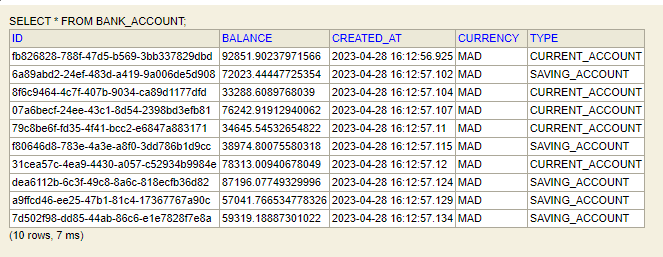
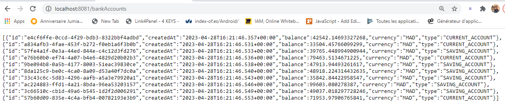
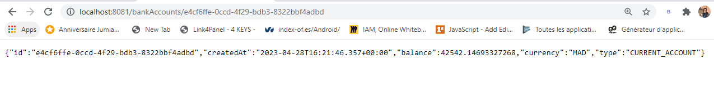
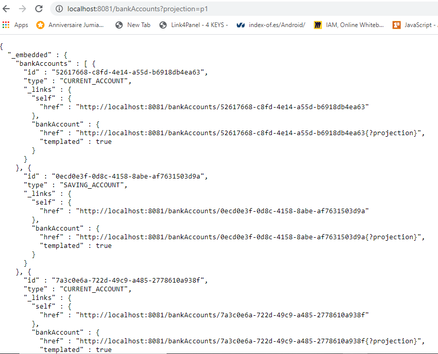
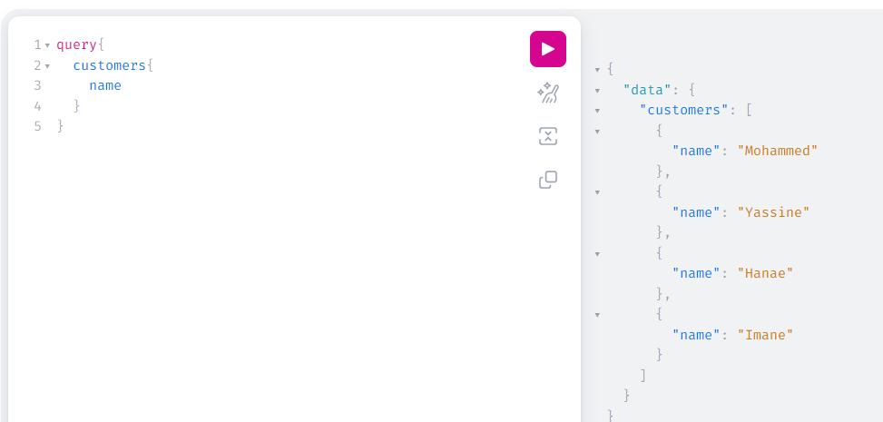

# MicroServices-Rest-GraphQl

<h3>Teste de la couche DAO</h3>

<h3>Tester le web micro-service en utilisant un client REST</h3>
<h5>get All</h5>

<h5>get ById</h5>

<h3>Générer et tester le documentation Swagger de des API Rest du Web service</h3>
<h3>Exposer une API Restful en utilisant Spring Data Rest en exploitant des projections</h3>

<h3>test d'un Web service GraphQL pour micro-service </h3>

